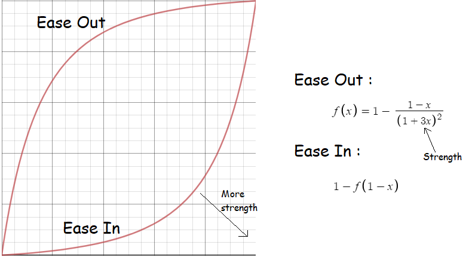

# Unity Transform Interpolator

Interpolates transform's position, rotation or scale over a period of time.

GIF frame rate is 15, actual video is not laggy

UPDATE : Added interpolation support for float variables.

<b>Interpolation Types (inbuilt) </b>: 
<ul>
  <li>LINEAR</li>
  <li>EASE IN</li>
  <li>EASE OUT</li>
</ul>

<b> EASE IN and EASE OUT follow following equation </b>  

<b>By default strength of the curve is set to 3  
You can specify it while calling AddTarget method  
</b>
 

<b>Attributes </b>: 
<ul>
  <li>POSITION</li>
  <li>ROTATION</li>
  <li>SCALE</li>  
  <li>FLOAT</li>
</ul>

<b>Optional parameters </b>: 
<ul>
  <li>Custom interpolator function and its params</li>
  <li>Ease function strength</li>
  <li>Callback action</li>
</ul>

<b>Usage </b>: 
<ul>
  <li>Assign <b>Interpolator.cs</b> to a gameobject in the scene</li>
  <li>Call <b>Interpolator.AddTarget</b> with a Transform, InterpolationType, Attribute, Target value and Period</li>
  <li>It will return an <b>ID</b> for its animation</li>
  <li>You can create custom interpolation type using <b>(Hashtable data) => {}</b> in AddTarget method</li>
  <li>Set <b>data["RETURN"]</b> to the delta value that your function calculates</li>
  <li>You can check whether the animation is complete using <b>Interpolator.IsActive(id)</b> method</li>
  <li>Or you can also assign a callback which will be called after animation is complete</li>
  <li>Specify it during AddTarget and give it an int parameter that will have ID of the animtion</li>
</ul>
